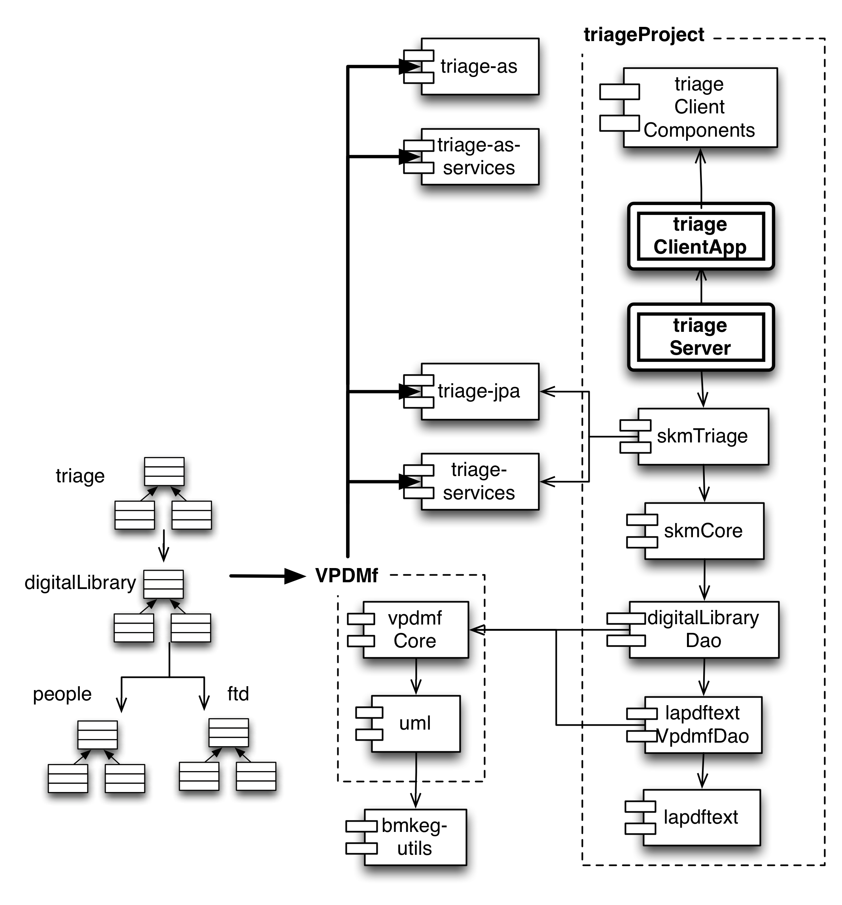

triageProject
=============

High-level build project for all SciKnowMine Triage submodules

We list ten submodules in this high-level repo. This is probably overkill since 
there's some repetition from the lapdftext project. We list these here. 

# [triageServer](https://github.com/BMKEG/triageServer) generates the web archive (*.war) file that 
runs on a web application container (such as Jetty, Tomcat, Glassfish, etc).
# [skmTriage](https://github.com/BMKEG/skmTriage) contains the server-side logic for all
administrative commands to generate, populate and edit the underlying database

3) [triageClientApp](https://github.com/BMKEG/triageClientApp) generates the *.swf file for the Flex web-application

4) [triageClientComponents](https://github.com/BMKEG/triageClientComponents) generates the *.swc library 
containing all the logic of the triageModule Flex component. 

5) [skmCore](https://github.com/BMKEG/skmCore) provides a basic layer on top of the digitalLibrary for other 
text mining applications using UIMA.

6) [digitalLibraryDao](https://github.com/BMKEG/digitalLibraryDao) provides a data access to the system for base
citaiton and document functions.

7) [lapdftext](https://github.com/BMKEG/lapdftext) is the core library for manipulating PDF documents.

8) [lapdftextVpdmf](https://github.com/BMKEG/lapdftextVpdmf) links the lapdftext library to the VPDMf framework 
via the FTD model.

9) [bmkeg-as-parent](https://github.com/BMKEG/bmkeg-as-parent) manages maven meta-data for AS projects.

10) [bmkeg-parent](https://github.com/BMKEG/bmkeg-parent) manages maven meta-data for Java projects.

The system is built on four linked VPDMf models

1) people - simply structures to manage names of people.
2) ftd - full text documents (mainly PDFs at this stage).
3) digitalLibrary - citation information, mainly linked to and pulled from PubMed.
4) triage - information pertaining to the triage process as we define it here. 
